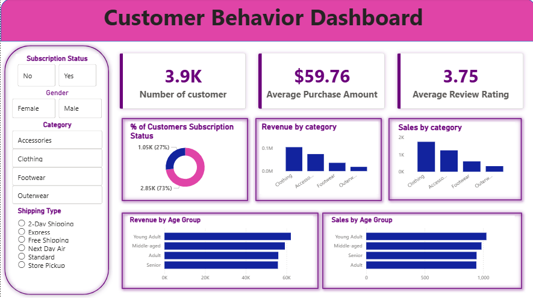

# customer_behavior_analysis
End-to-end data analytics project using Python, SQL and Power BI

## 📌 Objective
Analyze customer purchasing behavior to uncover trends, patterns, and insights
that help improve business decision-making.

## 🛠 Tools & Technologies
- Python (Pandas, NumPy, Matplotlib)
- SQL Server
- Power BI
- GitHub

## 🔄 Project Workflow
1. Data cleaning and preprocessing using Python
2. Data storage and querying using SQL Server
3. Exploratory Data Analysis (EDA)
4. Interactive dashboard creation using Power BI
5. Business insights and recommendations

## 📊 Key Insights
- Subscription customers purchase more frequently
- Seasonal trends affect purchase behavior
- Discount usage impacts repeat purchases

## 📸 Dashboard Preview

## 📁 Repository Structure
(see folders above)

## 🚀 How to Run
1. Clone the repo
2. Run Python notebook
3. Execute SQL scripts
4. Open Power BI file

## 📬 Contact
LinkedIn: (add your link)

